# OSI Multi-Network Security Lab

This is a student networking and cybersecurity project created using Cisco Packet Tracer.

The goal of this project is to practice networking concepts based on the OSI model and apply basic security configurations in a small multi-network environment.

## Project Overview

The network is divided into three main networks:

- IT Network
- Employees Network
- Servers Network

The topology includes:

- 2 Routers
- 3 Switches
- 4 Client PCs
- DHCP Server
- DNS Server
- Web Server
- FTP Server
- NTP Server

## Main Features

- VLAN 10 for IT
- VLAN 20 for Employees
- VLAN 30 for Servers
- Static Routing between networks
- DHCP for automatic IP assignment
- DNS for name resolution
- HTTP Web Server
- FTP Server
- SSH remote access
- Port Security using Sticky MAC
- Extended ACL for FTP access control
- NTP for time synchronization
- Ping and Traceroute for connectivity testing

---

## Network Topology

The following topology shows the complete network design.

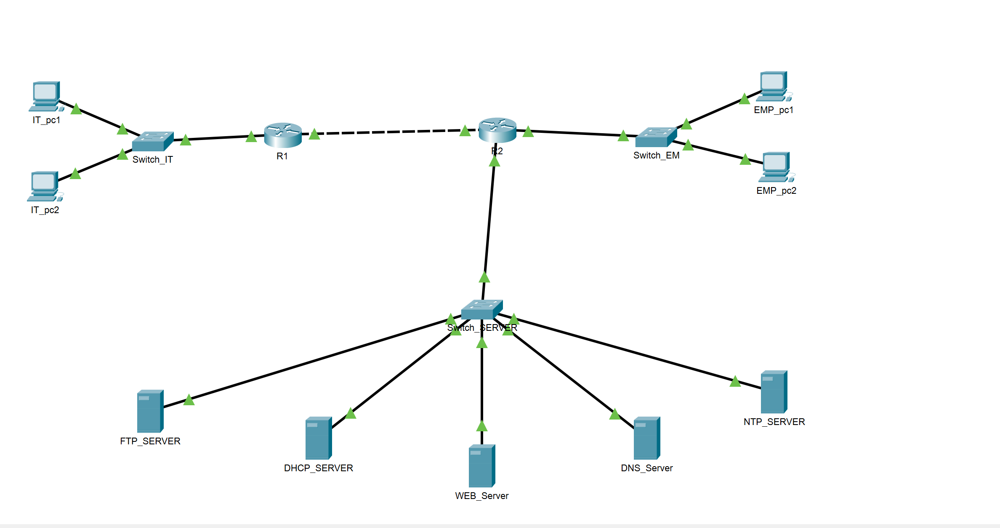

---

## VLAN Configuration

The network was divided into three VLANs to separate different departments and services.

### VLAN 10 - IT

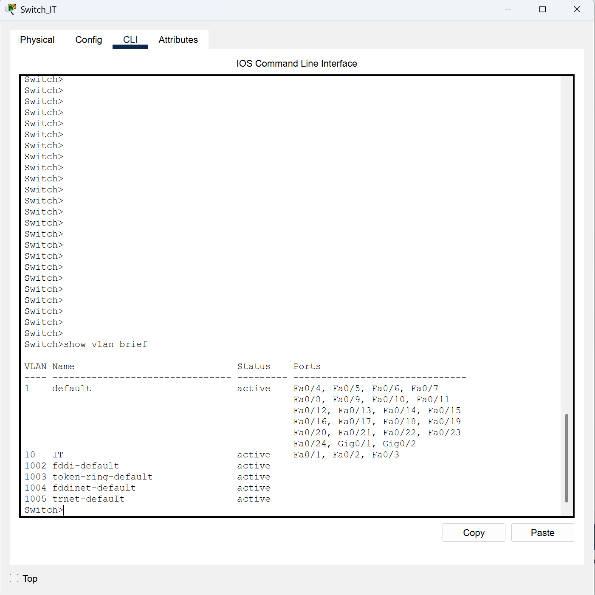

### VLAN 20 - Employees

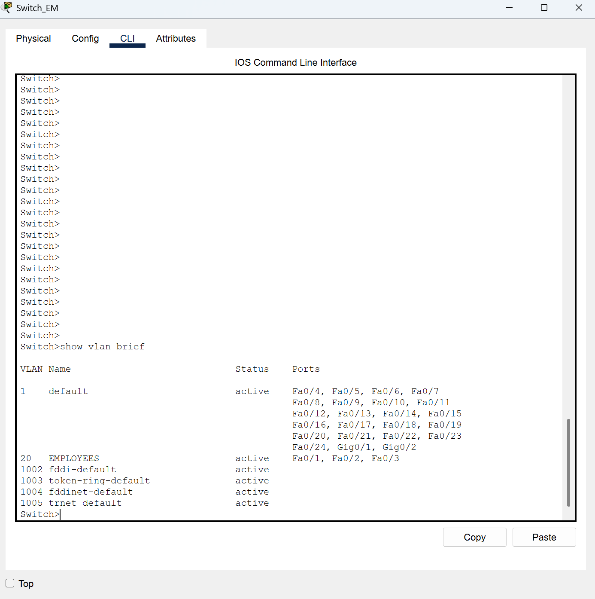

### VLAN 30 - Servers

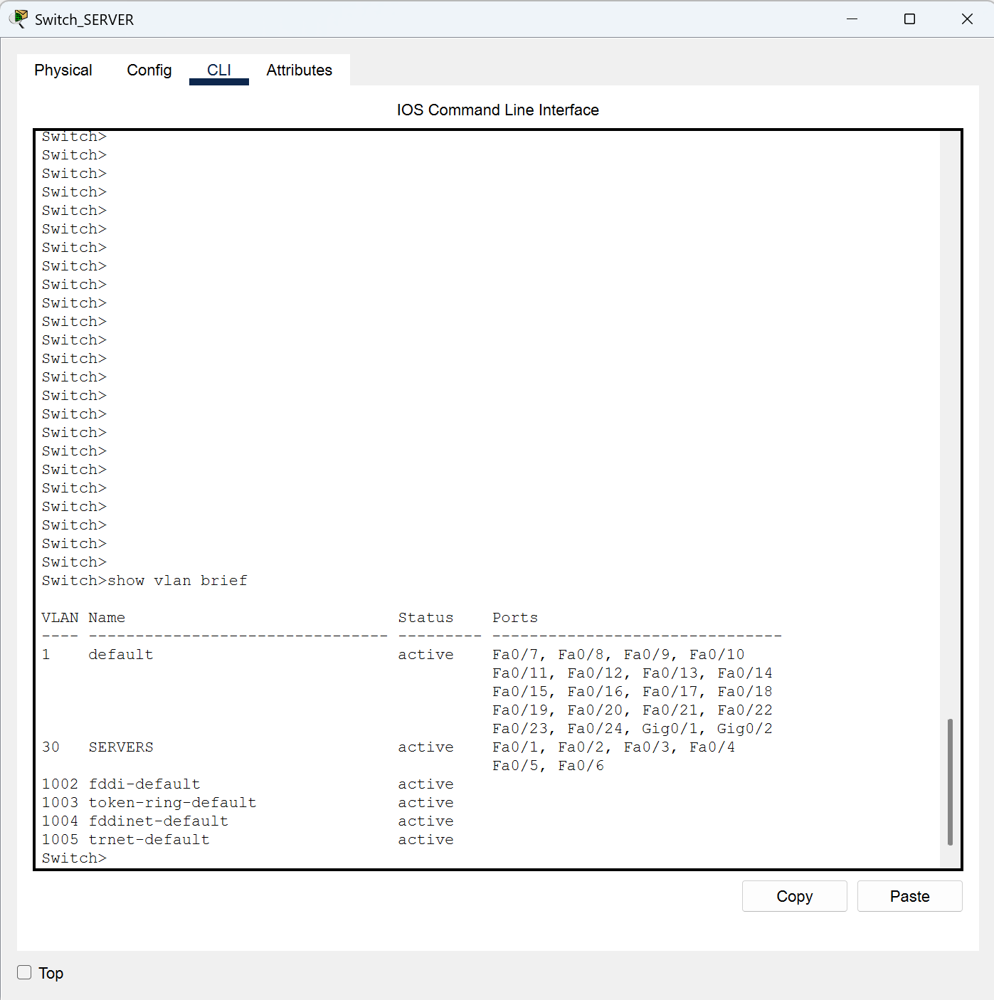

---

## Port Security

Port Security was configured on the IT switch.

Sticky MAC addresses were used to allow only one secure MAC address on each configured access port.

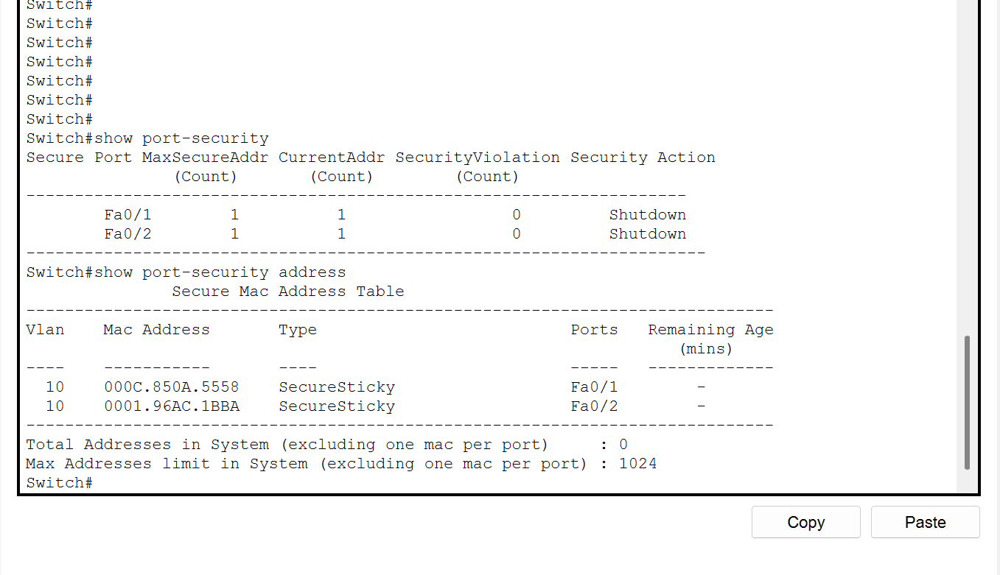

---

## Static Routing

Static routing was configured between R1 and R2 to allow communication between the three networks.

### R1 Routing

R1 is connected to the IT network and uses static routes to reach the Employees and Servers networks through R2.

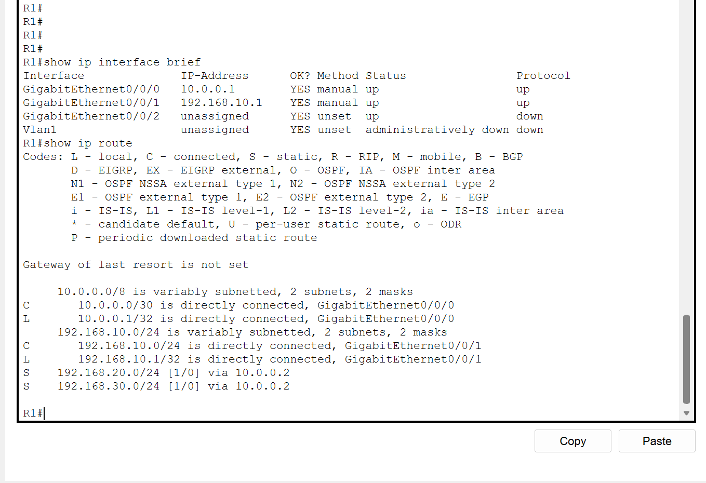

### R2 Routing

R2 is connected to the Employees network and Servers network and uses a static route to reach the IT network through R1.

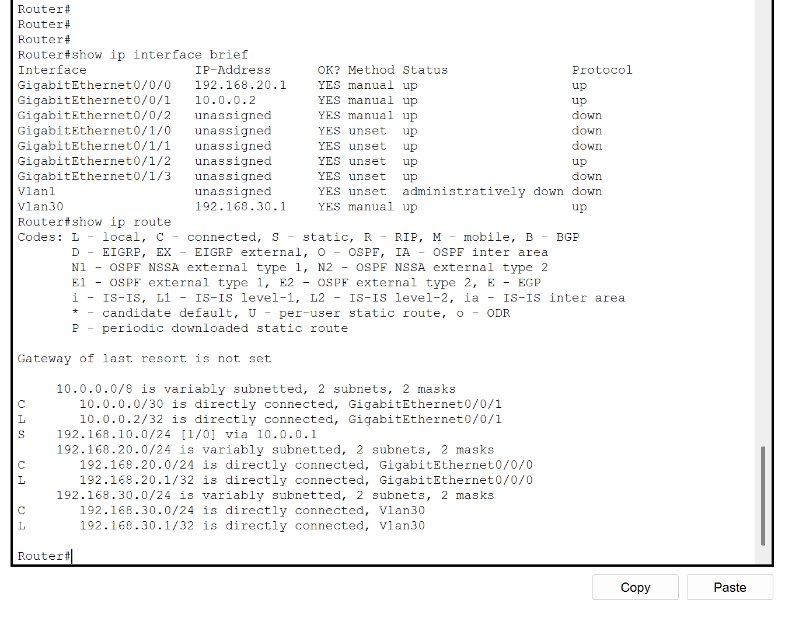

---

## Traceroute Test

Traceroute was used to verify the path from the IT network to the Web Server.

The path passes through:

1. R1 - `192.168.10.1`
2. R2 - `10.0.0.2`
3. Web Server - `192.168.30.2`

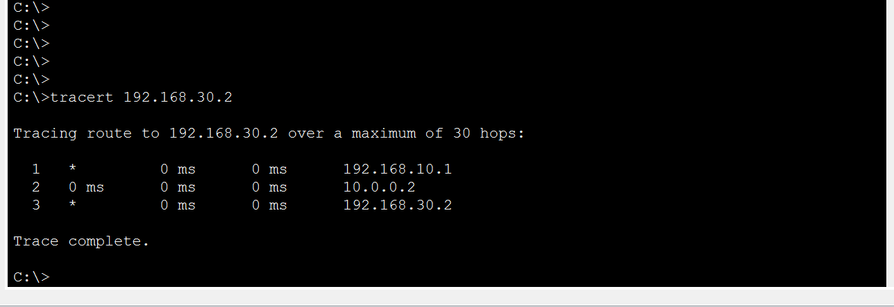

---

## Connectivity Testing

Ping tests were used to verify communication between different networks.

Successful communication was tested from the IT network to:

- Employees Network
- Servers Network

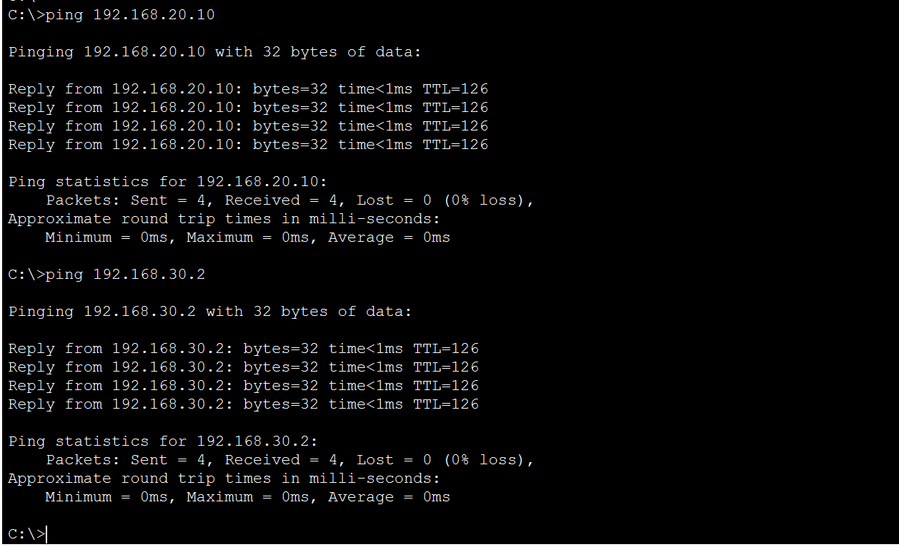

---

## DHCP Configuration

A DHCP Server was configured to automatically provide IP addresses to client devices.

DHCP pools were created for:

- IT Network
- Employees Network

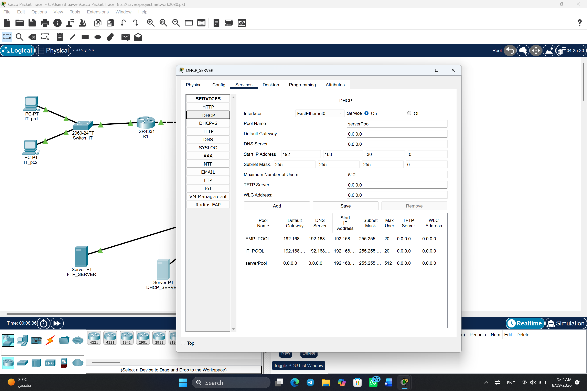

The following example shows an IT client receiving:

- IP Address: `192.168.10.10`
- Subnet Mask: `255.255.255.0`
- Default Gateway: `192.168.10.1`

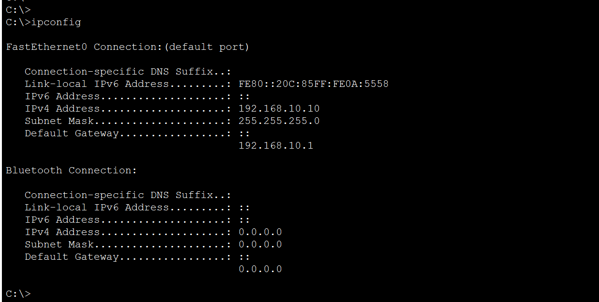

---

## DNS and HTTP

A DNS Server was configured to resolve the domain:

`www.company.local`

The domain points to the Web Server.

Users can access the website by entering:

`http://www.company.local`

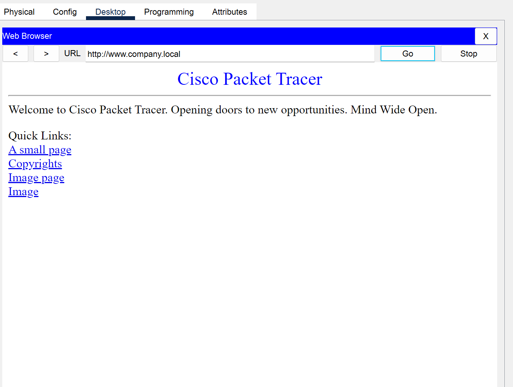

---

## FTP Server

An FTP Server was configured at:

`192.168.30.5`

A user account was created to authenticate before accessing the FTP service.

The FTP service was tested by logging in and listing files using the `dir` command.

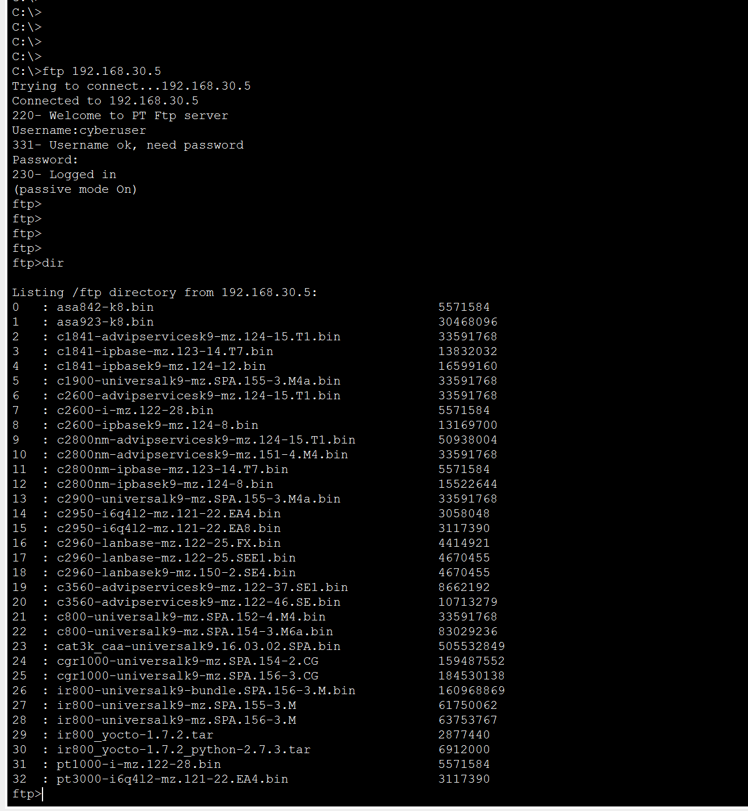

---

## SSH Remote Access

SSH was configured to provide secure remote management access to R1.

The router was successfully accessed remotely using SSH.

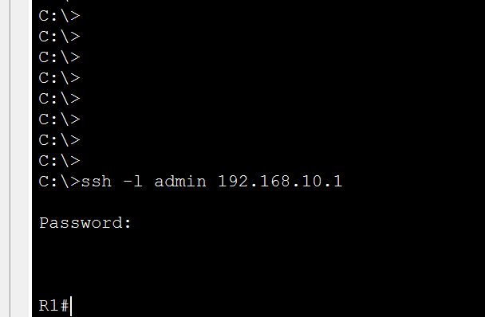

---

The ACL match counter confirms that the rule successfully blocked FTP traffic.

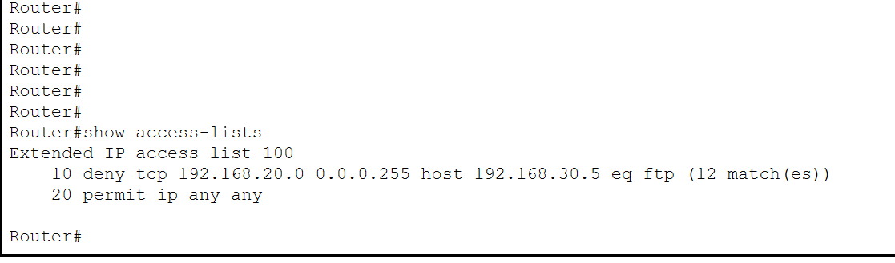

---

## NTP Time Synchronization

An NTP Server was configured at:

`192.168.30.6`

R1 was configured to synchronize its clock with the NTP Server.

The router successfully synchronized with the server.

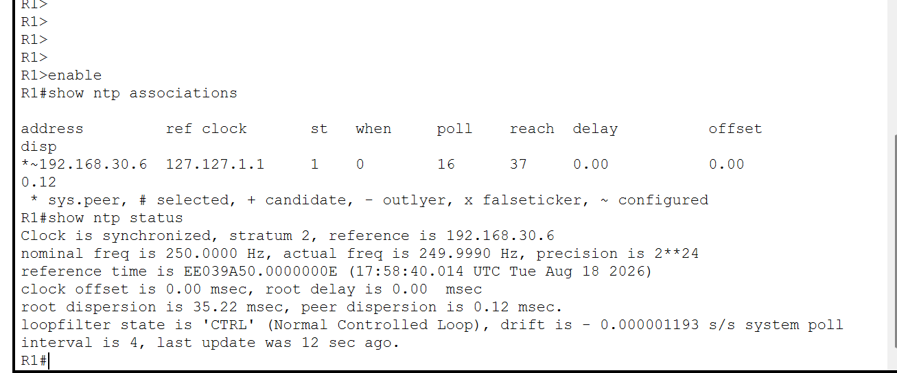

---

## Network Addressing

| Network | Subnet | Gateway |
|---|---|---|
| IT | `192.168.10.0/24` | `192.168.10.1` |
| Employees | `192.168.20.0/24` | `192.168.20.1` |
| Servers | `192.168.30.0/24` | `192.168.30.1` |
| R1-R2 Link | `10.0.0.0/30` | `10.0.0.1 / 10.0.0.2` |

---

## Server Addresses

| Server | IP Address |
|---|---|
| Web Server | `192.168.30.2` |
| DNS Server | `192.168.30.3` |
| DHCP Server | `192.168.30.4` |
| FTP Server | `192.168.30.5` |
| NTP Server | `192.168.30.6` |

---

## Protocols and Services Used

| Protocol / Service | Purpose |
|---|---|
| DHCP | Automatic IP configuration |
| DNS | Domain name resolution |
| HTTP | Web service |
| FTP | File transfer |
| SSH | Secure remote management |
| ICMP | Ping and network testing |
| NTP | Time synchronization |
| TCP | Used by services such as FTP, HTTP and SSH |
| UDP | Used by services such as DHCP, DNS and NTP |

---

## Security Features

The project includes several basic security features:

- VLAN network segmentation
- Port Security
- Sticky MAC addresses
- SSH secure remote access
- Extended ACL
- Restricted FTP access from the Employees network

---

## Tools Used

- Cisco Packet Tracer
- Cisco IOS CLI

---

## What I Learned

During this project, I practiced:

- Designing a network topology
- Understanding OSI model concepts
- Creating and configuring VLANs
- Configuring IP addressing
- Configuring static routing
- Using DHCP for automatic IP assignment
- Configuring DNS and HTTP services
- Configuring and testing FTP
- Configuring SSH remote access
- Applying Port Security
- Creating Extended ACL rules
- Configuring NTP
- Testing connectivity using Ping
- Troubleshooting network paths using Traceroute
- Understanding how networking and security concepts work together

---

## Project File

The Cisco Packet Tracer project file is included in this repository:

[OSI-Multi-Network-Security-Lab.pkt](OSI-Multi-Network-Security-Lab.pkt)

The file can be opened using Cisco Packet Tracer.

---

## Note

This project was created for educational purposes to practice networking and cybersecurity concepts.

